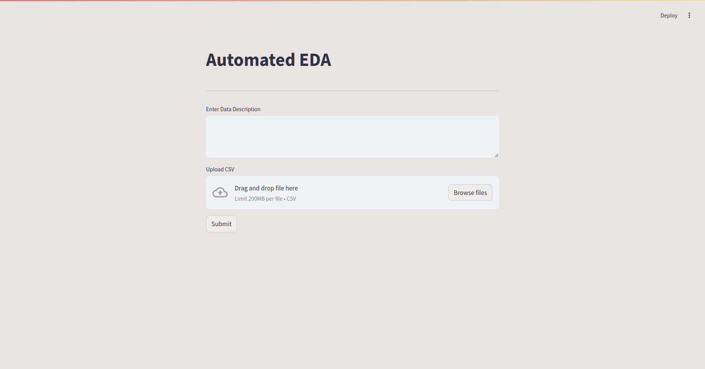

# EDA_Automation
### Project Overview

This project aims to automate the insights gathering done in exploratory data analysis but using a crew of AI agents to work interactively with each other. When given a data description , it tried to generate questions based on the description to find some relationship between the features , answers the questions created and summarizes it. Thus providing whole data summary. 

Note : For faster output, I have set the prompt to generate only 3 questions. If you want a detailed analysis, try to modify or remove 3 in the prompt.


### How to Run ?

1. Create an environment

```bash
conda create -p venv_aeda python=3.10 -y

conda activate ./venv_aeda
```

2. Install Requirements

```bash
pip install -r requirements.txt
```

3. Create .env file with GROQ_API_KEY 

4. Run the app.py file

```bash
streamlit run app.py
```

### Preview

Home Page :


Output : 


